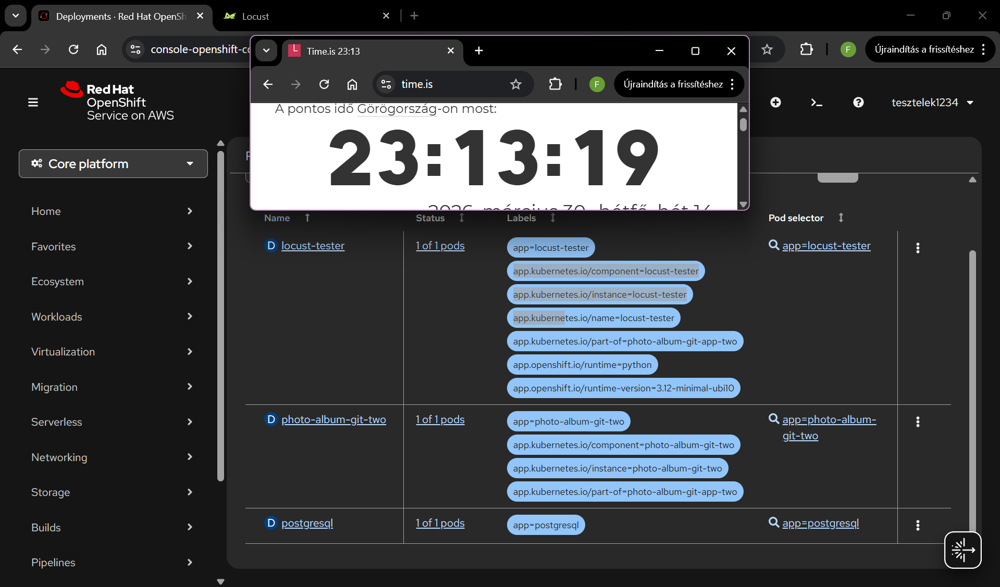
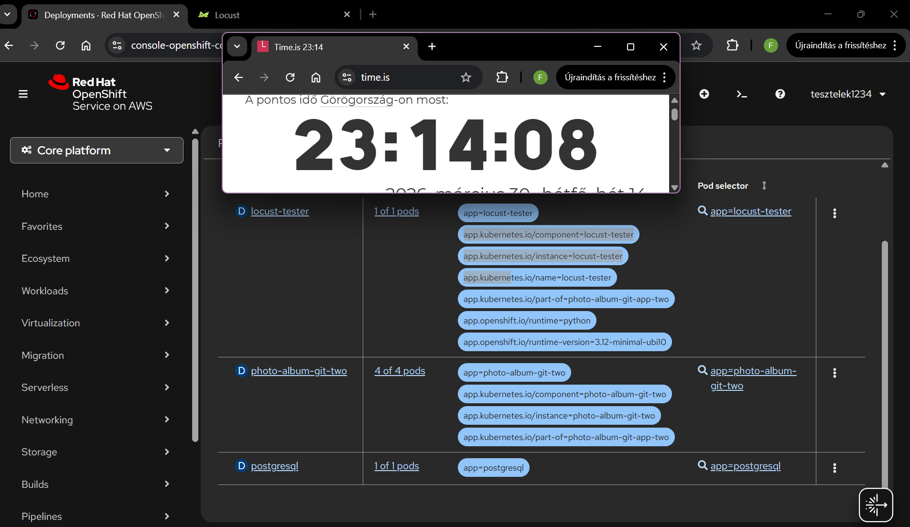
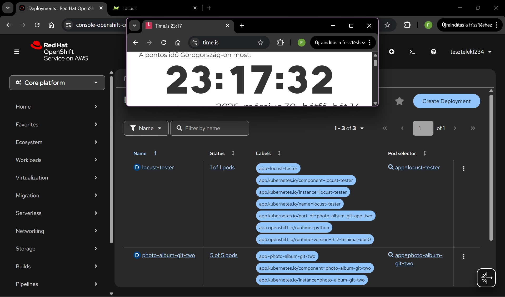
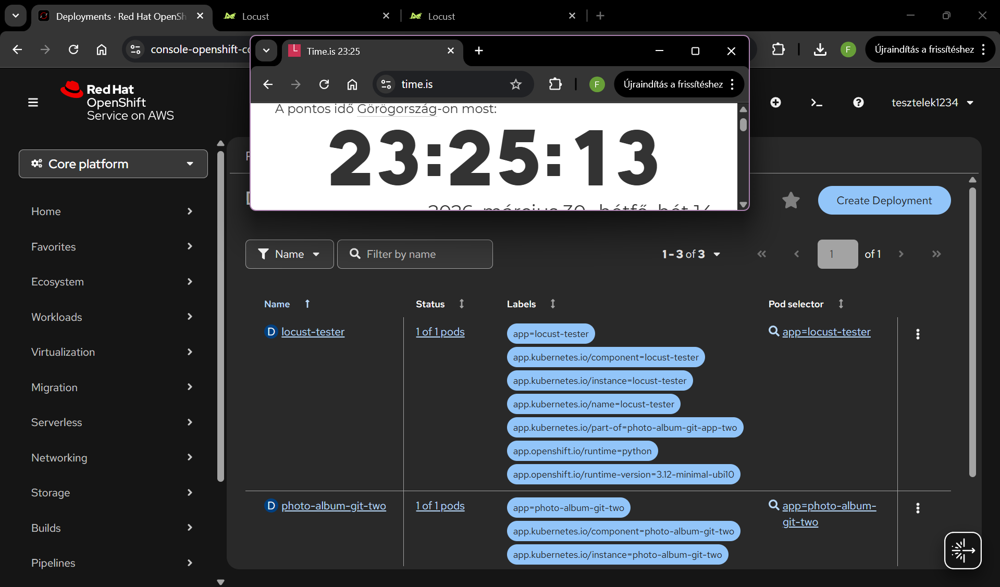
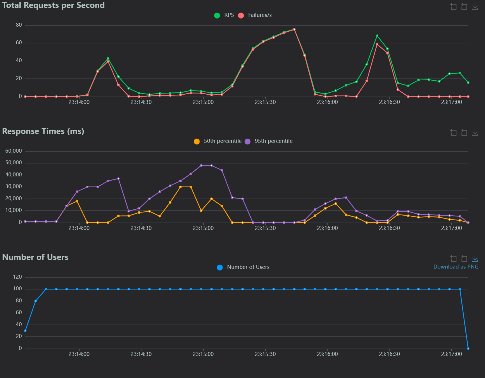

# Projekt Dokumentáció: Photo Album
## Választott környezet
* **Platform:** Red Hat OpenShift 
* **Deployment:** GitHub-alapú Source-to-Image (S2I) folyamat
* **Build folyamat:** Hálózati korlátok miatt az OpenShift build-végpontja nem érhető el kívülről a GitHub számára, ezért a Webhook-alapú automatizálás helyett manuálisan indított Build folyamat biztosítja a frissítéseket
* **Skálázhatóság:** Az alkalmazás alkalmas vízszintes skálázásra (Horizontal Scaling), így a terhelés függvényében több párhuzamos példány (Pod) is kiszolgálhatja a forgalmat
* **Adatbiztonság és Perzisztencia:** A futó példányok számától vagy újraindításától független adatmegőrzést a csatolt perzisztens tároló (PVC) biztosítja

---

## Alkalmazás rétegek

### 1. Megjelenítési réteg (Frontend)
* **Sablonkezelés:** Django Template Language (DTL)
* **Stílus:** Egyedi CSS, reszponzív kártya-alapú elrendezéssel

### 2. Alkalmazás réteg (Backend)
* **Framework:** Django (Python)
* **Logika:** 
    * `views.py`: Kép hozzáadás, listázás és törlés
    * `urls.py`: URL struktúra (pl. `<slug:name>/delete/`)

### 3. Adatréteg (Storage)
* **Adatbázis:** PostgreSQL
* **Fájlrendszer:** `media/` könyvtár a feltöltött képeknek
* **Perzisztencia:** **Persistent Volume Claim (PVC)** használata az adatok állandóságáért

---

## Biztonság
* **User Authentication:** Csak bejelentkezett felhasználók tölthetnek fel képet, illetve a  felhasználók csak a saját tartalmaikat törölhetik
* **CSRF védelem:** Minden űrlap (feltöltés, törlés) titkosított tokennel védett a Cross-Site Request Forgery támadások ellen

---

# Terheléses teszt és automatikus skálázódás vizsgálata – Jegyzőkönyv

## 1. Tesztkörnyezet konfigurációja
A méréshez egy izolált, Python-alapú **Locust** terhelésgeneráló egységet alkalmaztam az OpenShift clusteren belül.

## 2. Célalkalmazás paraméterei
* **HPA konfiguráció:**
    * Minimum példányszám: **1 pod**
    * Maximum példányszám: **5 pod**
    * Skálázási küszöbérték: **50% CPU** kihasználtság.
* **Erőforrás korlátok (Resources):**
    * CPU Request: `100m` / CPU Limit: `200m`.

## 3. Terhelés
* **Szimulált felhasználók:** 100 fő.
* **Felfutási ütem:** 10 felhasználó / másodperc.
* **Műveletek:** Galéria megtekintése, sorbarendezés, regisztráció, bejelentkezés, valamint képfeltöltés és törlés 

## 4. Eredmények

---
